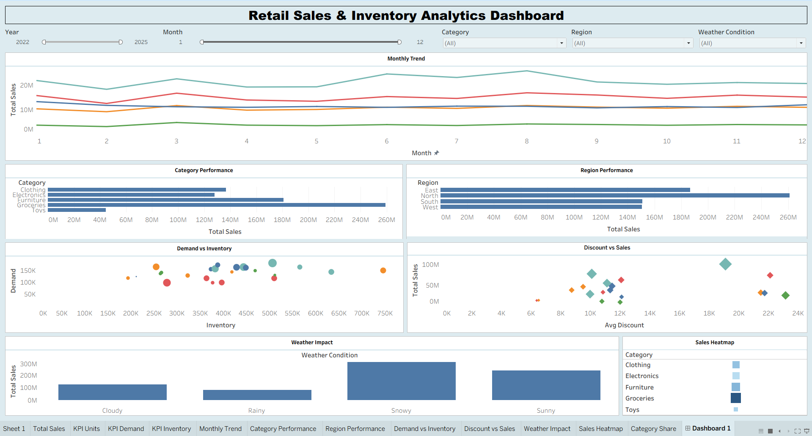

# SmartRetail: Retail Sales Analytics and Business Intelligence Dashboard

## Dashboard Preview



## Project Overview

SmartRetail is an end-to-end retail sales analytics project that analyzes sales performance, demand patterns, promotions, and inventory levels. The project uses Python for data cleaning and exploratory data analysis, SQL for business intelligence queries, and Tableau for interactive dashboard visualization.

## Project Workflow

Raw Dataset → Data Cleaning (Python) → SQL Business Analytics → Exploratory Data Analysis → Aggregated Insights → Tableau Dashboard

## Project Architecture

```
                Raw Data
                   │
                   ▼
            sales_data.csv
                   │
                   ▼
          datacleaning.ipynb
          (Data Cleaning)
                   │
                   ▼
         clean_retail_data.csv
                   │
                   ▼
              sales_base.sql
                   │
                   ▼
          SQL Analysis Scripts
     ┌─────────────┬─────────────┬─────────────┐
     │             │             │             │
summary_region  summary_store  summary_category
summary_date    summary_month  season_analysis
promotion_analysis  weather_analysis  demand_analysis
     └──────────────────────────────────────────┘
                   │
                   ▼
            final_summary.sql
                   │
                   ▼
           final_summary.csv
                   │
                   ▼
                EDA.ipynb
        (Exploratory Data Analysis)
                   │
                   ▼
           dashboard_data.csv
                   │
                   ▼
           SmartRetail.twb
        (Tableau Dashboard)
```


## Technologies Used

* Python (Pandas, NumPy, Matplotlib, Seaborn)
* SQL
* Tableau
* Jupyter Notebook

## Key Features

* Data cleaning and preprocessing pipeline
* Exploratory data analysis to understand sales trends
* SQL queries for business insights
* Analysis of sales by region, store, and product category
* Promotion and seasonality impact analysis
* Interactive Tableau dashboard for retail performance monitoring

## Key Business Insights

* Sales performance varies across regions and store locations.
* Promotional campaigns increase revenue but impact discount levels.
* Certain product categories show seasonal demand patterns.
* Inventory levels and demand trends provide insights for stock optimization.

## Files in the Repository

* `sales_data.csv` – Raw dataset
* `clean_retail_data.csv` – Cleaned dataset used for analysis
* `datacleaning.ipynb` – Data cleaning pipeline
* `EDA.ipynb` – Exploratory data analysis
* `*.sql` – SQL scripts for business analytics
* `SmartRetail.twb` – Tableau dashboard file

## Future Improvements

* Implement sales forecasting models
* Build automated inventory optimization analysis
* Deploy dashboard using web-based BI tools

## Author

Tirth Sodha
